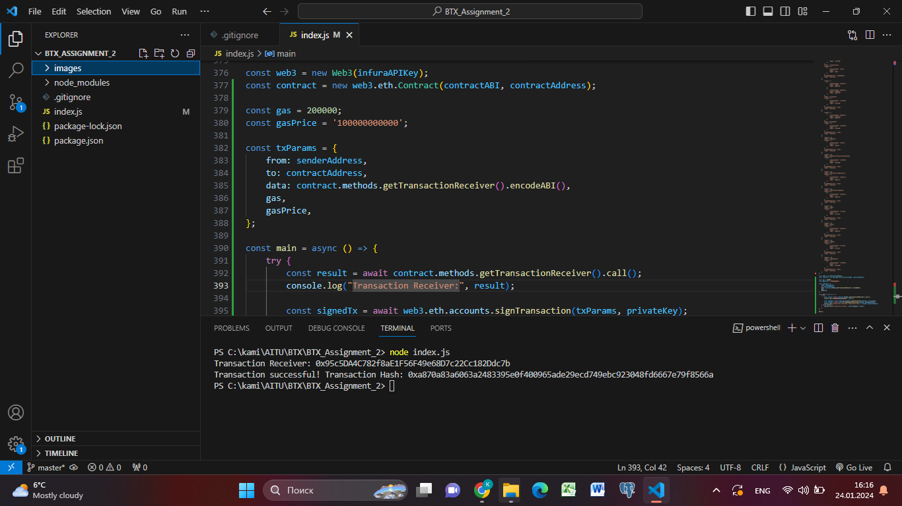
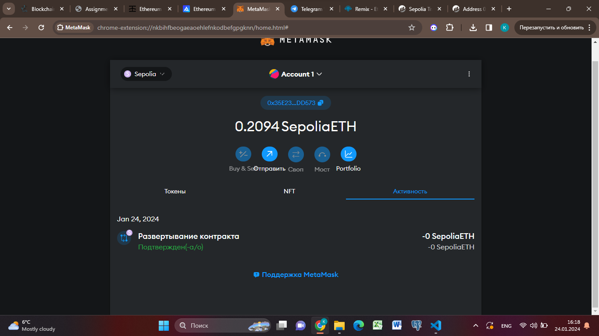

BTX_Assignment_2 by Kamilla Anuarbekova

Description: 
This Node.js script uses the Web3.js library to send transactions on the Ethereum blockchain.
It is tailored for interacting with a smart contract deployed on the Sepolia test network.
The script sends a transaction from a specified sender address to a contract address, 
calling a method to retrieve transaction information from the smart contract.

Demo:

  

Examples:

Prerequisites:
- Node.js installed
- Ethereum wallet with a private key for the sender address
- Infura API key for connecting to the Ethereum network

Installation:
1. Clone the repository: `https://github.com/creepymuffinn/BTX_Assignment_2`
2. Install dependencies: `npm i`

Configuration:
1. Open the `index.js` file.
2. Replace `infuraApiKey` with your Infura API key.
3. Replace `privateKey` with the private key of your Ethereum wallet.
4. Ensure `senderAddress` corresponds to your Ethereum wallet address.
5. Adjust other parameters like gas and gas price if necessary.

Run:
Execute the script by running: `node index.js`

Disclaimer:
This script is provided as-is and should be used responsibly. 
Ensure you have ownership of the private key and abide by the Ethereum network's rules and regulations. 
Use this script at your own risk.

License:
This project is licensed under the MIT License.
